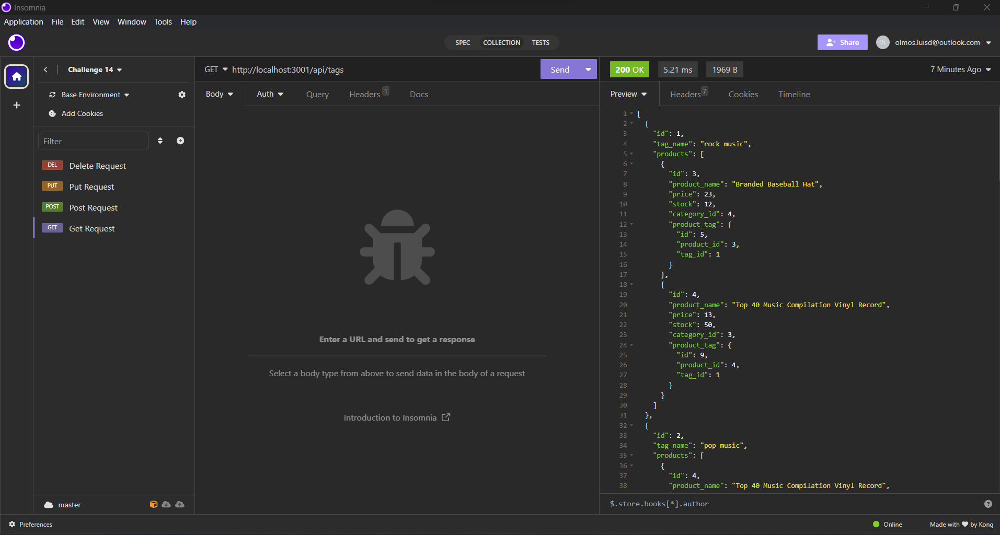

# E-Commerce Backend

## Description

This project utilizes routes for adding, updating, and deleting categories, products, and tags.

## Usage

This project runs using Node.js. Running "node server.js" will start the application to listen. Using Imsonia, the user can retrieve categories, products, and tags by using a GET request. The user will also be able to retrieve a single item as well. The user can also add new cateories, products, and tags and will be able to update an individual item as well. Finally, the user can delete any category, product, or tag if needed.

## Walkthrough Video

https://drive.google.com/file/d/1fydY1SoI7OvliS4lJf6CvJ_CWTQsWW4h/view?usp=drive_link
